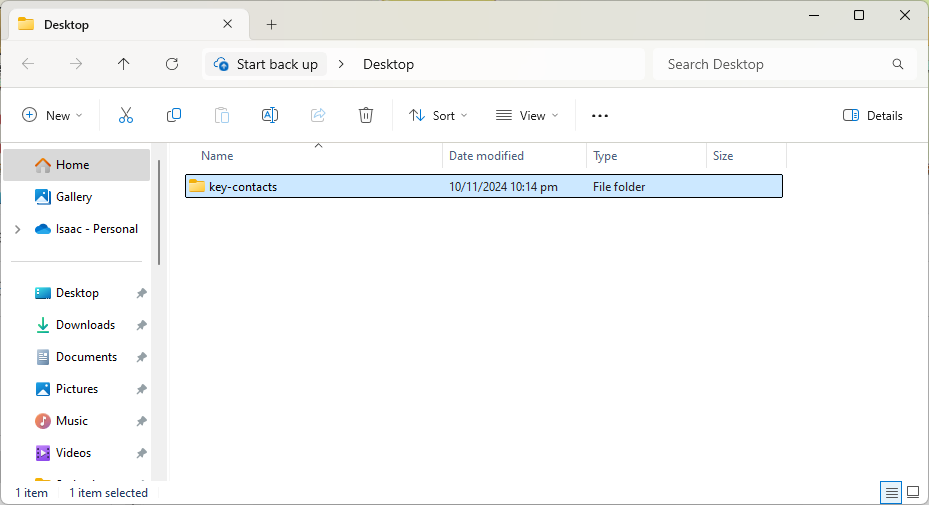
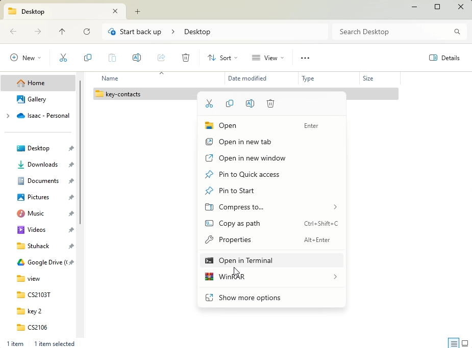
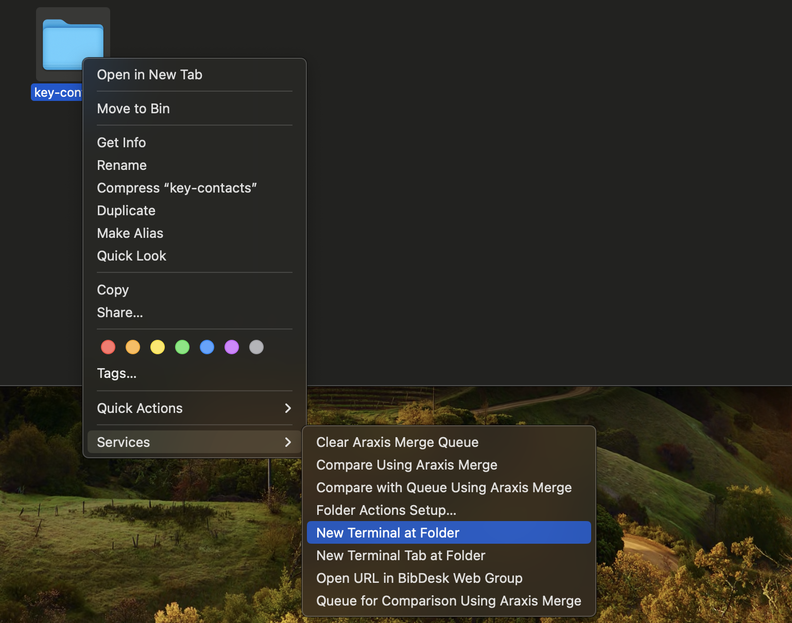
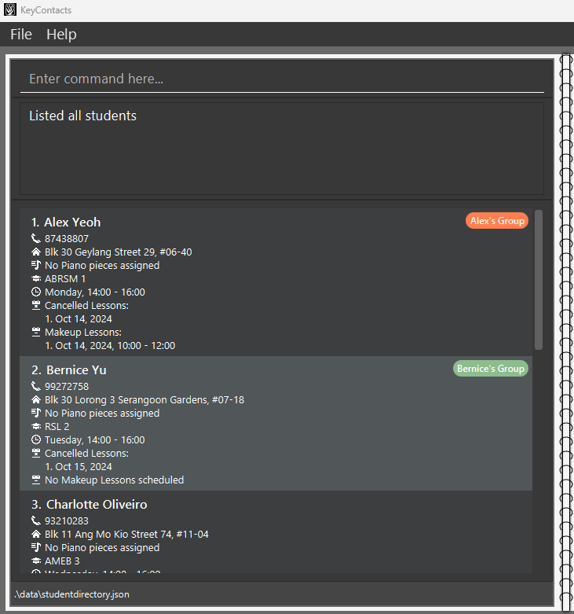
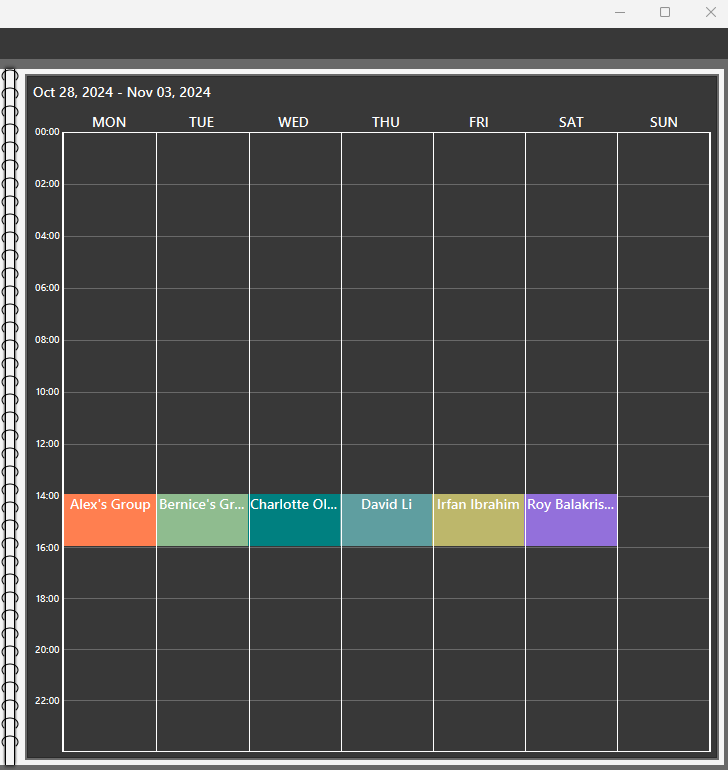
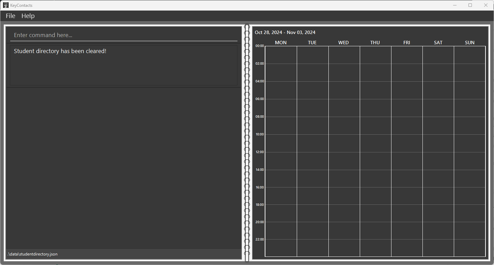

# User Guide

<box type="tip" light>
<b>KeyContacts</b> is a lightweight and responsive desktop app for <b>piano tutors</b> to quickly access and manage their students' information.
</box>

KeyContacts allows you to
   * Keep track of your students' **contacts**, **grade levels** and **pieces**.
   * Easily view all your scheduled lessons for the week at a glance through our **calendar view**.
   * **Schedule**, **cancel** and **make-up** lessons for your students.

&nbsp;

KeyContacts is optimized for use via keyboard commands while still being aesthetically pleasing and easy to use.
If you type fast, you can complete your contact management tasks much faster with KeyContacts than with mouse-based apps.

<!-- * Table of Contents -->

 

---

## Table of Contents

* [**Quick Start**](#quick-start)
* [**Command Overview**](#command-overview)
* [**Student Commands**](#student-commands)
  * [Adding a student: `add`](#adding-a-student-add)
  * [Deleting a student: `delete`](#deleting-a-student-delete)
  * [Editing a student: `edit`](#editing-a-student-edit)
  * [Assigning piano pieces to a student: `assign`](#assigning-piano-pieces-to-a-student-assign)
  * [Unassigning piano pieces from a student: `unassign`](#unassigning-piano-pieces-from-a-student-unassign)
* [**Lesson Commands**](#lesson-commands)
  * [Scheduling a regular lesson: `schedule`](#scheduling-a-regular-lesson-schedule)
  * [Scheduling a makeup lesson: `makeup`](#scheduling-a-makeup-lesson-makeup)
  * [Cancelling a lesson: `cancel`](#cancelling-a-lesson-cancel)
  * [Uncancelling a cancelled regular lesson: `uncancel`](#uncancelling-a-cancelled-lesson-uncancel)
* [**General Commands**](#general-commands)
  * [Viewing help: `help`](#viewing-help-help)
  * [Listing all students: `list`](#listing-all-students-list)
  * [Viewing the schedule: `view`](#viewing-the-schedule-view)
  * [Finding students: `find`](#finding-students-find)
  * [Sorting students: `sort`](#sorting-students-sort)
  * [Clearing all entries: `clear`](#clearing-all-entries-clear)
  * [Undoing the last command: `undo`](#undoing-the-last-command-undo)
  * [Redoing the last undone command: `redo`](#redoing-the-last-undone-command-redo)
  * [Exiting the program: `exit`](#exiting-the-program-exit)
* [**FAQ**](#faq)
* [**Known issues**](#known-issues)
* [**Command Summary**](#command-summary)

 

--------------------------------------------------------------------------------------------------------------------

## Quick start

1. Ensure you have Java `17` or above installed in your Computer.
    * To check your java version, refer [here](https://www.java.com/en/download/help/version_manual.html#).
    * If you don’t have Java `17` installed, you can download it [here](https://www.oracle.com/java/technologies/javase/jdk17-archive-downloads.html).

&nbsp;

2. Download the latest `keycontacts.jar` file from our releases page [here](https://github.com/AY2425S1-CS2103T-T08-2/tp/releases).
    * Scroll down until you reach *Assets*, then click on `keycontacts.jar`.
   

&nbsp;

3. Copy the file to the folder you want to use as the _home folder_ for KeyContacts.

<box type="tip" light>

<b>Tip:</b>

We recommend naming your home folder `key-contacts` and storing it on your Desktop.

&nbsp;

</box>

&nbsp;

4. Open a command terminal of your preference (e.g. Command Prompt on Windows, Terminal on Mac) from your home folder.

    * **On Windows**, right-click the folder and select `Open Command Terminal`.

&nbsp;
    

   * **On MacBook**, right-click the folder and select `Services`, then `New Terminal at Folder`. 

&nbsp;
     

&nbsp;

6. Run the command: `java -jar keycontacts.jar`

   You will see the app appear, filled with sample data:

   &nbsp;

    

7. Type a command in the command box and press _Enter_ to execute it.  
   **Example:** Typing **`help`** and pressing _Enter_ will open the help window.
    
   Some example commands you can try:
    * `list` : Lists all students.
    * `add n/John Doe p/98765432 a/John street, block 123, #01-01 gl/ABRSM 3` : Adds a student named `John Doe` to the student directory.
    * `schedule 2 d/mon st/08:00 et/10:00` : Schedules a weekly recurring lesson for the 2nd student on Monday from 8am to 10am.
    * `delete 3` : Deletes the 3rd student shown in the current list.
    * `clear` : Deletes all students.
    * `undo` : Undoes the last update to the student directory.
    * `exit` : Exits the app.
    
&nbsp;

 

--------------------------------------------------------------------------------------------------------------------

## Command Overview
<box type="tip" light>

<b>Tip:</b>

Refer to the <a href="#command-summary">Command Summary</a> for a table containing the full list of commands.
</box>

The commands you can use in KeyContacts are split into 3 different types:
   * [Student Commands](#student-commands)
   * [Lesson Commands](#lesson-commands)
   * [General Commands](#general-commands)

&nbsp;

Let's walk you through some basics of the command format. 

&nbsp;

Each command consists of a **command word**, and zero or more **parameters**. 

* Words in `UPPER_CASE` are the parameters to be supplied by you. 
  **Example:** In `add n/NAME`, `NAME` is a parameter which can be used as `add n/John Doe`.

* The parameter `INDEX` (e.g. in the command format `delete INDEX`) specifies the student to perform the operation on. 
`INDEX` refers to the index number shown **in the displayed student list** (at the top left of each student card). `INDEX` **must be a positive integer**, i.e. 1, 2, 3...

* Parameters in square brackets are optional. 
  **Example:** `[g/GROUP]` can be omitted or used as `g/Group One`.

* Parameters with `…`​ after them can be used multiple times. 
  **Example:** `pn/PIECE…​` can be used as `pn/Moonlight Sonata`, `pn/Moonlight Sonata pn/Ode to Joy` etc.

* Parameters can be in any order (excluding `INDEX`, which must follow the command word). 
  **Example:** If the command specifies `n/NAME p/PHONE_NUMBER`, `p/PHONE_NUMBER n/NAME` is also acceptable.

* Extraneous parameters for commands that do not take in parameters (i.e `help`, `list`, `undo`, `redo`, `exit` and `clear`) will be ignored. 
  **Example:** If the command specifies `help 123`, it will be interpreted as `help`.

<box type="warning" light >

**Caution:**

If you are using a PDF version of this document, be careful when copying and pasting commands that span multiple lines. This is because some space characters surrounding line-breaks may be omitted when copied over.

</box>

 

--------------------------------------------------------------------------------------------------------------------

## Student Commands

A student has a **name**, **phone number**, **address**, **grade level** and optionally, a **group**.   Students with
the same group name _(case-insensitive)_ will have synced [lessons](#lesson-commands).

<box type="info" light theme="primary">

**Note:**

Students with the same name _(case-insensitive)_ and phone number will be counted as **duplicate** students.
</box>
Listed below are the currently supported student commands.

Action     | Format, Examples
-----------|----------------------------------------------------------------------------------------------------------------------------------------------------------------------
**[Add](#adding-a-student-add)**    | `add n/NAME p/PHONE_NUMBER a/ADDRESS gl/GRADE_LEVEL [g/GROUP]`   e.g. `add n/James Ho p/22224444 a/123, Clementi Rd, 1234665 gl/LCM 1`
**[Delete](#deleting-a-student-delete)** | `delete INDEX`  e.g. `delete 3`
**[Edit](#editing-a-student-edit)**   | `edit INDEX [n/NAME] [p/PHONE_NUMBER] [a/ADDRESS] [gl/GRADE_LEVEL] [g/GROUP]`  e.g.`edit 2 n/James Lee p/81234567`
**[Assign](#assigning-piano-pieces-to-a-student-assign)** | `assign INDEX pn/PIECE_NAME...`  e.g.`assign 1 pn/Moonlight Sonata pn/Canon in D`
**[Unassign](#unassigning-piano-pieces-from-a-student-unassign)** | `unassign INDEX [pn/PIECE_NAME]...`  e.g. `unassign 1 pn/Moonlight Sonata pn/Canon in D`

 
 

### Adding a student : `add`

Adds a student to the student directory.

Format: `add n/NAME p/PHONE_NUMBER a/ADDRESS gl/GRADE_LEVEL [g/GROUP]`

* If a group is not provided, or left blank (`g/`), the student will not be assigned to any group.
* If an existing group is provided, the student will be assigned all the lessons of the other students in the group.

Examples:
* `add n/John Doe p/98765432 a/John street, block 123, #01-01 gl/LCM 1` adds a student named `John Doe` with phone number `98765432`, address `John Street, block 123, #01-01`, grade level `LCM 1`, and no group.

&nbsp;

* `add n/Mary Sue p/87654321 a/Mary avenue, block 51, #10-10 gl/ABRSM 1 g/Jack's Group` adds a student named `Mary Sue` with phone number `87654321`, address `Mary avenue, block 51, #10-10`, grade level `ABRSM 1` and group `Jack's Group`. Mary Sue will have `Jack's Group`'s lessons.

<box type="tip" light>

**Tip:**

Does the app keep telling you that you are trying to insert a duplicate student? Check that you are not entering a student that already exists in the directory! See our definition of duplicate students [here](#student-commands).
</box>
 
 

### Deleting a student : `delete`

Deletes the specified student from the student directory.

Format: `delete INDEX`

* Deletes the student at the specified `INDEX`.

Examples:
* `delete 2` deletes the 2nd student.

<box type="tip" light>

**Tip:**

If you accidentally deleted the wrong student, you can use the [undo](#undoing-the-last-command-undo) command to
revert your action.
</box>
 
 

### Editing a student : `edit`

Edits an existing student in the student directory.

Format: `edit INDEX [n/NAME] [p/PHONE] [a/ADDRESS] [gl/GRADE_LEVEL] [g/GROUP]`

* Edits the student at the specified `INDEX`.
* If the group is left blank (`g/`), the student will be removed from any existing group.
* Removing a student from a group also **removes all the student's lessons**.
* Existing values will be updated to the input values.
* You must provide **at least one** of the optional fields.

Examples:
*  `edit 1 n/Jane Doe p/91234567` edits the name and phone number of the 1st student to be `Jane Doe` and `91234567` respectively.
*  `edit 1 n/Penelope g/` removes the 1st student from their group, while also editing their name to be `Penelope`.
*  `edit 2 g/Jack's Group` moves the 2nd student into the group `Jack's Group`. The 2nd student will also be updated to have `Jack's Group`'s lessons.

 
 

### Assigning piano pieces to a student : `assign`

Assigns piano pieces to a student in the student directory.

Format: `assign INDEX pn/PIECE_NAME...`

* Assigns piano pieces to the student at the specified `INDEX`.
* Existing piano pieces will remain.

Examples:
*  `assign 1 pn/Etude pn/Moonlight Sonata` adds `Etude` and `Moonlight Sonata` to the 1st student's piano pieces.

 
 

### Unassigning piano pieces from a student : `unassign`

Unassigns piano pieces from a student in the student directory.

Format: `unassign INDEX [pn/PIECE_NAME]...`

* Unassigns piano pieces from the student at the specified `INDEX`.
* All piano pieces provided must already be assigned to the student.
* If no piano pieces are provided, all piano pieces will be unassigned from the student.

Examples:
*  `unassign 1 pn/Etude pn/Moonlight Sonata` removes `Etude` and `Moonlight Sonata` from the 1st student's piano pieces.
*  `unassign 2` clears all the 2nd student's piano pieces.
 
 

--------------------------------------------------------------------------------------------------------------------

## Lesson Commands

Each student can have **one regular lesson** in the same timeslot every week. You can also create make-up lessons and cancel
lessons for each student. 

<box type="tip" light>

**Tip:**

Our app helps prevent scheduling mishaps by not allowing overlapping lessons. If you try to schedule clashing lessons, we’ll catch it and notify you right away!

</box>

Listed below are the currently supported lesson commands.

Action     | Format, Examples
-----------|----------------------------------------------------------------------------------------------------------------------------------------------------------------------
**[Schedule](#scheduling-a-regular-lesson-schedule)** | `schedule INDEX d/DAY st/START_TIME et/END_TIME`  e.g.`schedule 1 d/Monday st/12:00 et/14:00`
**[Makeup](#scheduling-a-makeup-lesson-makeup)** | `makeup INDEX dt/DATE st/START_TIME et/END_TIME`  e.g.`makeup 1 dt/25-12-2022 st/12:00 et/14:00`
**[Cancel](#cancelling-a-lesson-cancel)** |  `cancel INDEX dt/DATE st/START_TIME`   e.g. `cancel 1 dt/14-10-2024 st/12:00`
**[Uncancel](#uncancelling-a-cancelled-lesson-uncancel)** |  `uncancel INDEX dt/DATE`   e.g. `uncancel 1 dt/14-10-2024`

 
 

### Scheduling a regular lesson : `schedule`

Schedules a **weekly recurring** regular lesson for the specified student in the student directory.

Format: `schedule INDEX d/DAY st/START_TIME et/END_TIME`

* Schedules the regular lesson for the student at the specified `INDEX`. 
* Regular lessons are **synced** across students in the **same group**.
* If the student already has an existing regular lesson, **it will be overwritten** by the new regular lesson.
* `DAY` must be a day of the week (e.g. Monday, Tuesday etc.) or its 3-letter abbreviation (e.g. Mon, Tue etc.). This parameter is _case-insensitive_.
* `START_TIME` and `END_TIME` must be in 24-hour format (`HH:MM`), and `START_TIME` must be before `END_TIME`.

Example:
* `schedule 1 d/Tuesday st/16:00 et/18:00` schedules a regular lesson every Tuesday, 4-6pm for the 1st student.

 
 

### Scheduling a makeup lesson : `makeup`

Schedules a makeup lesson for the specified student in the student directory.

Format: `makeup INDEX dt/DATE st/START_TIME et/END_TIME`

* Schedules the makeup lesson for the student at the specified `INDEX`. The index refers to the index number shown in the displayed student list. The index **must be a positive integer** 1, 2, 3, …​
* Makeup lessons are **synced** across students in the **same group**.
* `DATE` must be a valid date in the format `DD-MM-YYYY`.
* `START_TIME` and `END_TIME` must be in 24-hour format (`HH:MM`) and `START_TIME` must be before `END_TIME`.

Examples:
* `makeup 1 dt/25-12-2024 st/12:00 et/14:00` schedules a makeup lesson on 25th December 2024, 12-2pm for the 1st student.

 
 

### Cancelling a lesson : `cancel`

Cancels a lesson for the specified student in the student directory.

Format: `cancel INDEX dt/DATE st/START_TIME`

* Cancels a lesson for the student at the specified `INDEX`, on the specified `DATE` that starts at the specified `START_TIME`.
* Cancellations are synced across students in the same group.
* `DATE` must be a valid date in the format `DD-MM-YYYY`.
* `DATE` must match the student's lesson `DATE`, and `START_TIME` must match the student's lesson `START_TIME`.
* `START_TIME` must be in 24-hour format (`HH:MM`).

Example:
* `cancel 1 dt/15-10-2024 st/16:00` cancels a lesson on 15th Oct 2024, starting at 4pm for the 1st student.

<box type="info" light theme="primary">

**Note:**

The cancel command supports cancelling **both regular and makeup lessons**! 
Cancelled makeup lessons will be removed, while cancelled regular lessons appear as a list of dates in the student card.

</box>

  
 

### Uncancelling a cancelled lesson : `uncancel`

Uncancels a cancelled lesson for the specified student in the student directory.

Format: `uncancel INDEX dt/DATE`

* Uncancels a regular lesson for the student at the specified `INDEX`.
* Uncancelling a lesson removes it from the student's cancelled lesson list.
* `DATE` must be a valid date in the format `DD-MM-YYYY`.
* `DATE` must match the student's cancelled lesson `DATE`.

Example:
* `uncancel 1 dt/20-10-2024` uncancels a regular lesson on 20th Oct 2024 for the 1st student.

<box type="tip" light>

**Tip:**

The `uncancel` command only supports uncancelling of regular lessons. To uncancel a makeup lesson, simply reschedule it with the [makeup](#scheduling-a-makeup-lesson-makeup) command.
</box>

 

--------------------------------------------------------------------------------------------------------------------

## General Commands

Listed below are the currently supported general commands.

Action     | Format, Examples
-----------|----------------------------------------------------------------------------------------------------------------------------------------------------------------------
**[Help](#viewing-help-help)**   | `help`
**[List](#listing-all-students-list)**   | `list`
**[View](#viewing-the-schedule-view)**   | `view [dt/DATE]`  e.g. `view dt/01-10-2024`
**[Find](#finding-students-find)**   | `find [n/NAME_KEYWORD] [p/PHONE_KEYWORD] [a/ADDRESS_KEYWORD] [gl/GRADE_LEVEL_KEYWORD] [g/GROUP_KEYWORD]`  e.g. `find n/James gl/ABRSM`
**[Sort](#sorting-students-sort)**   | `sort [n/ASC or DESC] [p/ASC or DESC] [a/ASC or DESC] [gl/ASC or DESC] [g/ASC or DESC]`  e.g. `sort g/ASC n/DESC`
**[Clear](#clearing-all-entries-clear)**  | `clear`
**[Undo](#undoing-the-last-command-undo)**   | `undo`
**[Redo](#redoing-the-last-undone-command-redo)**   | `redo`
**[Exit](#exiting-the-program-exit)**   | `exit`

 
 

### Viewing help : `help`

Shows a message explaining how to access the help page.

Format: `help`

 
 

### Listing all students : `list`

Shows a list of all students in the student directory.

Format: `list`

 
 

### Viewing the schedule : `view`

Displays the lesson schedule for the specified week.

Format: `view [dt/DATE]`

* If no date is provided, the current date will be used.
* `DATE` must be in the format `DD-MM-YYYY`.

Examples:
* `view` displays the schedule for the current week.
* `view dt/01-11-2024` displays the schedule for 28 Oct 2024 (Monday) to 3 Nov 2024 (Sunday).

 

<box type="info" light theme="primary">

**Note:**

The schedule will exclude lessons that are cancelled for that week.

</box>

 

 
 

### Finding students : `find`

Finds students whose personal details match inputs.

Format: `find [n/NAME_KEYWORD] [p/PHONE_KEYWORD] [a/ADDRESS_KEYWORD] [gl/GRADE_LEVEL_KEYWORD] [g/GROUP_KEYWORD]`

* The search is **case-insensitive**. e.g `hans` will match `Hans`
* Only the name, phone number, address, grade level and group is searched.
* Partial inclusion of a keyword will be considered a match. e.g `ng` will match `huang`
* Students matching all fields will be returned (i.e. `AND` search).
  e.g. `n/Hans p/98765432` will return `Hans Gruber; 98765432`, but not `Hans Goretzka; 12345678`
* You must provide **at least one** of the optional fields.

Examples:
* `find n/John` returns all students with `John` in their name, such as `john` and `Johnny Doe`
* `find n/will p/8765` returns all students with `will` in their name **and** phone number containing `8765`, such as  `william; 87654321` but **not** `will; 12341234`

<box type="tip" light>

**Tip:**

You can use the [list](#listing-all-students-list) command to clear the previous find results and display all students again!

</box>

 
 

### Sorting students : `sort`

Sorts students based on personal details.

Format: `sort [n/ASC or DESC] [p/ASC or DESC] [a/ASC or DESC] [gl/ASC or DESC] [g/ASC or DESC]`

* The **order** of prefixes **matters**. If there are ties in the first field, later fields will be used to tie-break.
* Only name, phone number, address, grade level and group are valid fields to sort by.
* The sorting order must be `ASC` (**ascending**) or  `DESC` (**descending**), and is _case-insensitive_.
* You must provide **at least one** of the optional fields.

To clear the sorting conditions, use the command `sort clear`.

Examples:
* `sort n/ASC` sorts the students by name in ascending order.
* `sort gl/DESC n/ASC` sorts the students by grade level in descending order, and tie-breaks using name in ascending order.

<box type="info" light theme="primary">

**Note:**

All sorting is performed in [ASCII order](https://www.pcmag.com/encyclopedia/term/ascii-sort), meaning lower-cased letters come after all upper-cased letters. 
e.g "A" comes before "B", but "a" comes after "B".

</box>

 
 

### Clearing all entries : `clear`

Clears all entries from the student directory.

Format: `clear`

 

<box type="tip" light>

**Tip:**

Accidentally used the `clear` command? No need to worry! You can use the `undo` command to revert your action!  
Do <b>NOT</b> exit out of the application before you undo, as you will lose your data permanently.

</box>

 
 

### Undoing the last command : `undo`

Undoes the last command that modified the student directory.

Format: `undo`

<box type="tip" light>

**Tip:**

1. Undo only affects commands that **modify student entries**.  
   For example, if you ran the command `delete 1` to delete student `Alex Yeo`, followed by the command `find Bernice`, running `undo` will restore student `Alex Yeo`.

2. You can undo **multiple** commands in a row that modified the student directory.
</box>

 
 

### Redoing the last undone command : `redo`

Restores any changes that were previously undone using the `undo` command.

Format: `redo`

<box type="tip" light>

**Tip:**

1. If you make another change to **student entries** after an `undo` command, you can no longer revert that `undo` command. 
For example, if you ran `delete 2`, then `undo`, then `delete 1`, you can no longer `redo` the `delete 2` command.

2. You can redo **multiple** changes in a row.
</box>

 
 

### Exiting the program : `exit`

Exits the program.

Format: `exit`

 

--------------------------------------------------------------------------------------------------------------------

## FAQ

**How do I save my data?** 
Student directory data is saved in the hard disk automatically after any command that changes the data. There is no need to save manually.

 

**Help, why does it keep telling me that my date needs to be a valid date?** 
Firstly, make sure that your date exists (take note of the 29th of February on non-leap years).
Next, make sure that your date is following the `DD-MM-YYYY` format (pay attention to the hyphens in between).  
_Example: `30-10-2024` is allowed, while `30/10/2024` is not allowed._

 

**Can I edit the saved data file manually?** 
Student directory data is saved automatically as a JSON file at `[JAR file location]/data/studentdirectory.json`.  Advanced users are welcome to update data directly by editing that data file.

<box type="warning" light>
<b>Caution:</b> 

   * If your changes to the data file makes its format invalid, KeyContacts will discard all data and start with an empty data file at the next run.
Hence, it is recommended to make a backup of the file before editing it.
   * Certain edits can cause KeyContacts to behave in unexpected ways 
(e.g., if a value entered is outside the acceptable range). Therefore, edit the data file only if you are confident that you can update it correctly.
</box>

 

**How do I transfer my data to another computer?** 
You can do so by copying the data file over to the other computer as follows:
1. Copy the `studentdirectory.json` file in the data folder over to the other computer.
2. Download KeyContacts in the other computer.
3. [Run KeyContacts](#quick-start) in the other computer. This will generate a `data` folder containing a sample `studentdirectory.json` file.
4. Replace this sample data file with the data file you copied from your previous computer.

 

--------------------------------------------------------------------------------------------------------------------

## Known issues

1. **When using multiple screens**, if you move the application to a secondary screen, and later switch to using only the primary screen, the GUI will open off-screen. The remedy is to delete the `preferences.json` file created by the application before running the application again.  
2. **If you minimize the Help Window** and then run the `help` command (or use the `Help` menu, or the keyboard shortcut `F1`) again, the original Help Window will remain minimized, and no new Help Window will appear. The remedy is to manually restore the minimized Help Window.

 

--------------------------------------------------------------------------------------------------------------------

## Command summary

Action     | Format, Examples
-----------|----------------------------------------------------------------------------------------------------------------------------------------------------------------------
**[Add](#adding-a-student-add)**    | `add n/NAME p/PHONE_NUMBER a/ADDRESS gl/GRADE_LEVEL [g/GROUP]`   e.g. `add n/James Ho p/22224444 a/123, Clementi Rd, 1234665 gl/LCM 1`
**[Delete](#deleting-a-student-delete)** | `delete INDEX`  e.g. `delete 3`
**[Edit](#editing-a-student-edit)**   | `edit INDEX [n/NAME] [p/PHONE_NUMBER] [a/ADDRESS] [gl/GRADE_LEVEL] [g/GROUP]`  e.g.`edit 2 n/James Lee p/81234567`
**[Assign](#assigning-piano-pieces-to-a-student-assign)** | `assign INDEX pn/PIECE_NAME...`  e.g.`assign 1 pn/Moonlight Sonata pn/Canon in D`
**[Unassign](#unassigning-piano-pieces-from-a-student-unassign)** | `unassign INDEX [pn/PIECE_NAME]...`  e.g. `unassign 1 pn/Moonlight Sonata pn/Canon in D`
**[Schedule](#scheduling-a-regular-lesson-schedule)** | `schedule INDEX d/DAY st/START_TIME et/END_TIME`  e.g.`schedule 1 d/Monday st/12:00 et/14:00`
**[Makeup](#scheduling-a-makeup-lesson-makeup)** | `makeup INDEX dt/DATE st/START_TIME et/END_TIME`  e.g.`makeup 1 d/25-12-2022 st/12:00 et/14:00`
**[Cancel](#cancelling-a-lesson-cancel)** |  `cancel INDEX dt/DATE st/START_TIME`   e.g. `cancel 1 dt/14-10-2024 st/12:00`
**[Uncancel](#uncancelling-a-cancelled-lesson-uncancel)** |  `uncancel INDEX dt/DATE`   e.g. `uncancel 1 dt/14-10-2024`
**[Help](#viewing-help-help)**   | `help`
**[List](#listing-all-students-list)**   | `list`
**[View](#viewing-the-schedule-view)**   | `view [dt/DATE]`  e.g. `view dt/01-10-2024`
**[Find](#finding-students-find)**   | `find [n/NAME_KEYWORD] [p/PHONE_KEYWORD] [a/ADDRESS_KEYWORD] [gl/GRADE_LEVEL_KEYWORD] [g/GROUP_KEYWORD]`  e.g. `find n/James gl/ABRSM`
**[Sort](#sorting-students-sort)**   | `sort [n/ASC or DESC] [p/ASC or DESC] [a/ASC or DESC] [gl/ASC or DESC] [g/ASC or DESC]`  e.g. `sort g/ASC n/DESC`
**[Clear](#clearing-all-entries-clear)**  | `clear`
**[Undo](#undoing-the-last-command-undo)**   | `undo`
**[Redo](#redoing-the-last-undone-command-redo)**   | `redo`
**[Exit](#exiting-the-program-exit)**   | `exit`
